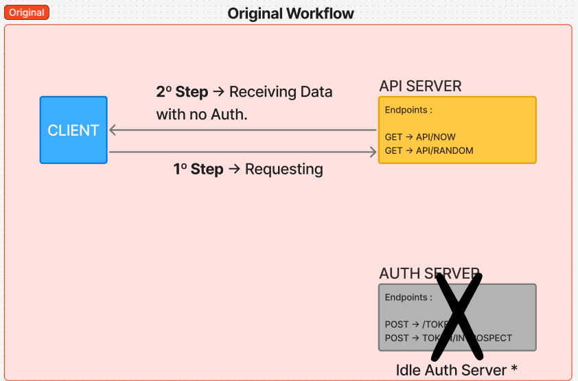
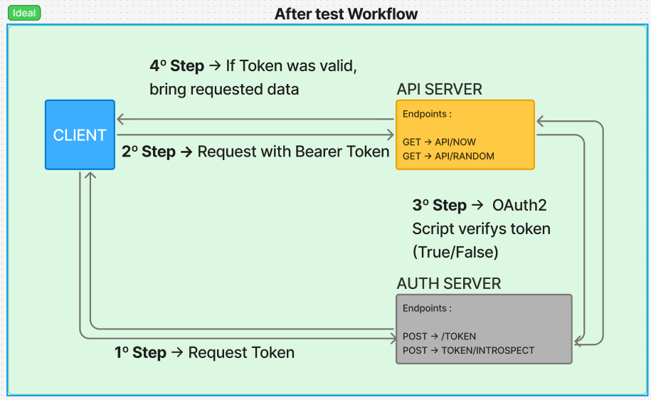

# OAuth2 API Protection Challenge 🛡️

Solution for the technical challenge of implementing security in a REST API using **Spring Boot** and **OAuth2**.

This project transforms an open API into a secure **Resource Server**, capable of validating **Opaque Tokens** via **Introspection** on an external Authorization Server.

## 🔗 Challenge Context

This project is the resolution for the technical case proposed in the following repository:

> **Challenge Repository on GitLab -> https://gitlab.com/raidiam-conformance/open-finance/conformance-tech-task-one)**

**Objective:** Protect the endpoints `/api/now` and `/api/random`, which were originally public, utilizing an authentication server provided via Docker.


## 🏗️ Solution Architecture

To solve the challenge, the **Token Introspection** flow was implemented. Unlike JWT tokens (which can be validated locally/offline), opaque tokens require the API to query the authentication server to verify if the token is valid.

### Implemented Workflow
1.  **Client** requests a token from the Auth Server.
2.  **Client** sends a request with the Header `Authorization: Bearer <token>`.
3.  **API** intercepts the request and validates the token against the Auth Server (`/introspect`).
4.  **API** grants or denies access to the resource.

### Project Diagrams

***Figma link used for this project : 

**1. Previous State (Problem)**


**2. Ideal Workflow (Implemented)**



## 🚀 Technologies Used

* **Java 17**
* **Spring Boot 3**
* **Spring Security** (OAuth2 Resource Server)
* **Docker & Docker Compose** (Auth Server)
* **JUnit 5 & MockMvc** (Integration Tests)
* **Gradle**


## ⚙️ Prerequisites

* Docker and Docker Compose installed.
* JDK 17+ installed.
* Ports **8082** (API) and **8081** (Auth Server) must be free.


## 🛠️ How to Run

### 1. Start the Authentication Server
The Auth Server is a prerequisite and runs in a container. In the project root, execute:

bash
```docker compose up -d```


*Wait until the service is active at `http://localhost:8081`.*

### 2. Run the API

With the Auth Server running, start the Spring Boot application:

bash
# Linux/Mac
./gradlew bootRun

# Windows (PowerShell)
.\gradlew bootRun


*The API will start on port 8082.*


## 🧪 How to Test (Manual: Postman / Insomnia)

### Step 1: Get Token (Authorization Server)
Create a new **POST** request to `http://localhost:8081/token` with the following settings:

* **Auth Tab:** Select **Basic Auth**.
    * Username: `client1`
    * Password: `abcde12345`
* **Body Tab:** Select **Form URL Encoded** (`x-www-form-urlencoded`) and add:
    * `grant_type`: `client_credentials`
    * `scope`: `api || ramndom || now`
    * `client_id` : `client1`
    * `client_secret` : `abcde12345`

*Action: Click Send. Copy the `access_token` from the JSON response.*

### Step 2: Access Protected API
Create two new **GET** requests to `http://localhost:8082/api/now` and `http://localhost:8082/api/random`  with the following settings:

* **Auth Tab:** Select **Bearer Token**.
    * Token: Paste the `access_token` you copied in Step 1.

*Action: Click Send. You should receive a `200 OK` with the current time. (/api/now)*
*Action: Click Send. You should receive a `200 OK` with a random number. (/api/random)*

### Step 3: Security Test (Sad Path)
Try to access those endpoints **without** token (or disable the Auth tab).

*Action: Click Send. You should receive `401 Unauthorized` for both endpoints*


## ✅ Automated Tests

Integration tests were implemented using `MockMvc` and `Spring Security Test`. The goal is to ensure security without relying on the Docker container running during the build.

To run the tests:

bash
./gradlew test


**Test Highlights:**

* **Isolation:** Use of `.with(opaqueToken())` to simulate a valid token without calling the external server.
* **Data Validation:** Use of Regex (`matchesPattern`) to validate if the `/random` endpoint returns valid numbers, even if they come as Strings in the JSON.
* * **Data Validation:** Use of mockMvc to validade is api/now bring back a time data format.
* **Scenarios:** Coverage of "Happy Path" (with token) and "Sad Path" (without token).


## 📝 Technical Decisions

1. **Explicit Configuration:** Use of `@EnableWebSecurity` and a dedicated `SecurityConfig` class to ensure full control over the filter chain, rather than relying solely on Spring's auto-configuration.
2. **Opaque Token Handling:** Specific configuration in `application.properties` pointing to the introspection endpoint (`/token/introspect`), as required by the limitation of not supporting JWTs.

---
-> This document was created with the help of Gemini.*
```
